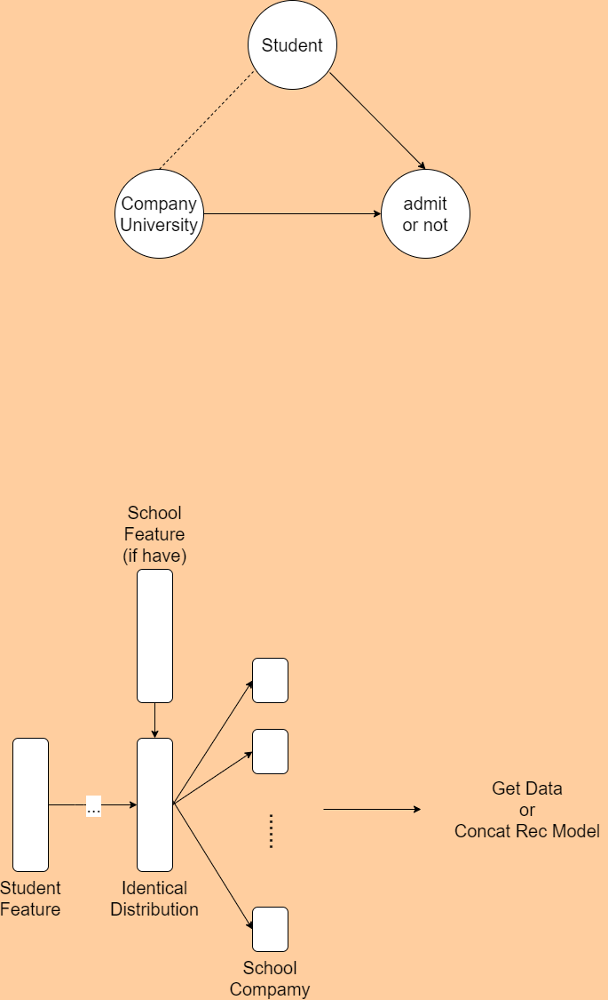

### Context

For an aspiring graduate student, choosing which universities to  apply to is a conundrum. Often, the students wonder if their profile is  good enough for a certain university.  This issue can be addressed by  building a recommendation system based on various classification  algorithms. 

### Content

Original.csv contains profiles of students with admits/rejects to 45 different universities in USA.
 score.csv contains score conversion for GRE old to GRE new score mechanism.

### Acknowledgements

Thanks to [Aditya Sureshkumar](https://github.com/aditya-sureshkumar/University-Recommendation-System) for scraping the information from Eludix.

### Inspiration

Building  a University recommendation system

https://www.kaggle.com/nitishabharathi/university-recommendation

## Data

53645 items

有的数据：一个学生存在多个申请，多个申请里面也存在申上和没有申上。

- student：14798

- school： 54

- admit：52%的申请得到了通过

## Problem

+ [ ] 貌似没有学校的特征？
+ [x] 感觉这个问题不是PU Learning的问题？-- 把学校特征和学生特征拼接起来就是PU Learning问题
+ [ ] 我们自己的数据集做出的推荐结果如何进行评价
+ [ ] 要是没有学校特征的话，无法做PU Learning。
+ [ ] 预处理里对gpa做归一化有问题
+ [ ] 原始数据根本就没有unlabelled的数据，也没法儿做PU Learning？

## Unlabelled Solution

#### 没有学校特征的情况

是一个典型的含有混杂的反事实问题：不同的学生因为对自己能力评估的不同，申请的学校也就不同。因此，每个学校申请人的分布是不一样的，这就是Selection Bias。

因此要先学习学生的特征到同一分布的特征空间上，再对每个学校分别进行预测。

#### 有学校特征的情况

当作一个含有混杂的反事实+学生学校匹配问题。

把学习到的同分布的学生特征与学校特征进行拼接

#### PU Learning

该问题应该属于PU Learning中的case-control scenarios。因为正样本并不是随机选出的。

:star:应该对每个学校分别来做PU Learning

把学生特征和学校特征（如果有的话）进行拼接，来做PU Learning。

#### Motivation

在PU Learning中，正样本都是来自于同一个样本分布的。但是在我们的问题中，由于学校不同导致申请样本来自不同的分布（每个学校的申请样本来自同一个分布），这会导致传统的PU Learning方法效果不好。在Causal field中，这是由选择偏差所造成的。因此，我们提出了Causal  Unlabelled Learning来解决这一问题。

#### Model

## Evaluation

#### 对Unlabelled data

## Data Preprocessing

- userName:无缺失，变成id
- major:244个类别，缺失放在类别0
- researchExp:无缺失，大部分为0.考虑变为有无的0-1变量
- industryExp:同reasearchExp类似
- specializarion:40%缺失，3621类，考虑使用0-1变量表示有无
- toeflScore:有缺失，把缺失置为0
- program:有缺失，共四类，把缺失放在第五类
- department:1个缺失，把缺失那一行剔除。1486类
- toeflEssay:将近80%缺失，去掉该列。
- internExp:14个缺失，缺失置为0.大部分为0.考虑使用0-1变量表示是否为0.
- greV:少部分缺失，缺失置为0.数值型变量
- greQ:同greV
- userProfileLink:去除
- greA:缺失值置为0。大部分为0，考虑使用0-1变量表示是否为0.
- journalPubs:同greA
- confPubs:同greA
- topperCgpa:3个缺失，删除那三行。数值型变量
- termAndYear:56类，缺失值为第57类
- ugCollege:1822类，缺失为新的一类
- gmatA:大部分缺失，去掉
- gmatQ:同上
- gmatV:同上
- cgpa:无缺失，数值型
- cgpaScale:无缺失，数值型
- univName:无缺失，54类
- admit：无缺失，多一半为1

## Idea

- 在一般的推荐问题中，对每一个用户可以使用PU Learning，从而得到负样本。

